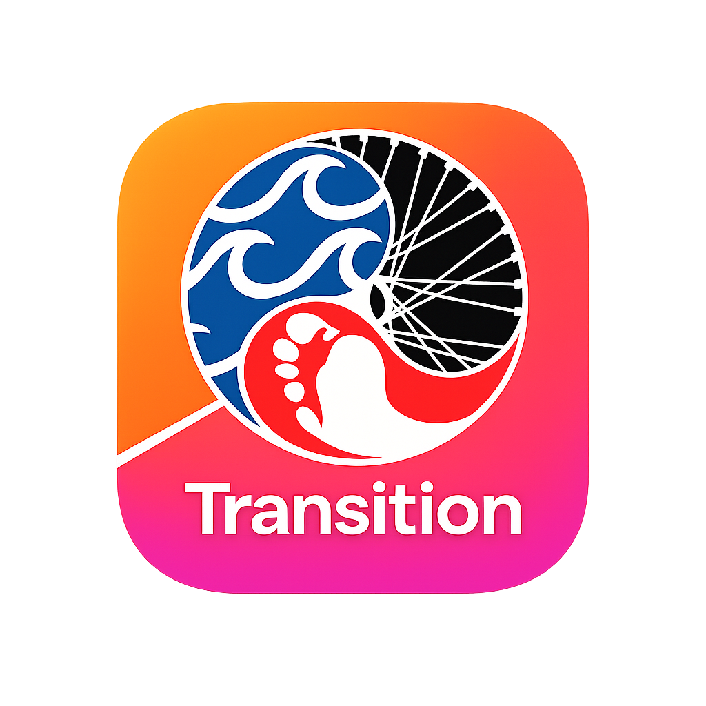

  

# Transition for Strava

Transition for Strava is a mobile-first web app that helps you export your Strava activities as files you can import into other apps.

## What it does
- **Log in with Strava**
- **Pick an activity**
- **Export as GPX or FIT**
- **Download and share/open** the file in another app

## How to use it
1. Open the website
2. Tap **Continue with Strava**
3. Choose an activity
4. Tap **Export**
5. Choose **GPX** or **FIT**
6. Download the file, then share/open it from your device

## Notes and limitations
- **Not all activities can be exported** (for example: indoor/manual activities or privacy-restricted activities may not include a GPS track).
- **Mobile downloads vary by browser**:
  - iOS often requires opening the file from Safari downloads / Files before sharing to another app.
  - Android behavior varies by browser and download settings.

## Privacy
- We do **not** store your Strava credentials.
- We do **not** store your activity files.
- Your login uses Strava OAuth and is kept in a secure session while you use the app.

## GPX vs FIT
- **GPX**: generated from the activity track data.
- **FIT**: generated from the same data (it is **not necessarily the original device upload**).

## Support
If something doesn’t work, please open an issue in this repository with:
- What device/browser you’re using
- What you clicked
- The error message you saw

## Disclaimer
This project is not affiliated with Strava.

