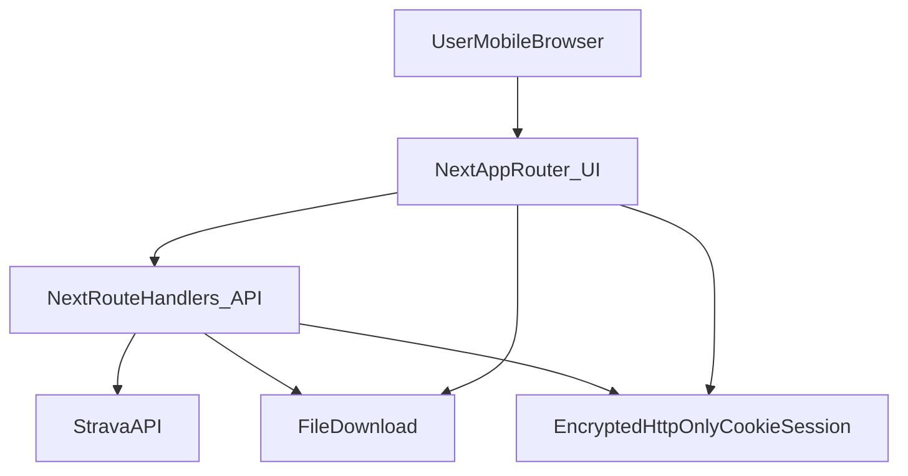

# Transition for Strava

Mobile-first micro web app that lets a user:

1) Log in with Strava (OAuth)
2) Choose an activity
3) Choose export format **per activity, at export time** (GPX or FIT)
4) Download and share/open in another app

## V1 product spec

### Target user + job
- **User**: A Strava athlete on mobile who wants to move specific activities into another app.
- **Core job**: Log in → pick an activity → choose export format → download → share/open elsewhere.

### User flows + acceptance criteria

#### 1) Authenticate with Strava
- User taps “Continue with Strava”.
- App redirects to Strava authorization and returns via OAuth callback.

**Acceptance criteria**
- OAuth uses `https://www.strava.com/oauth/authorize` and code exchange.
- App never stores Strava tokens in `localStorage`.
- Session is stored in **secure, httpOnly cookies** (encrypted).

#### 2) Browse activities (mobile-first)
- App shows a simple list of recent activities (default: 30).
- Optional filters: date range chips (7d / 30d / 90d), type filter.

**Acceptance criteria**
- Activities list loads for authenticated users.
- Clear loading, empty, and error states are usable on small screens.

#### 3) Export per-activity with format choice (critical)
- Each activity card has an “Export” action.
- Tapping “Export” opens a small picker (bottom sheet/modal) with:
  - “Export GPX”
  - “Export FIT”
- Availability rules:
  - If both are available, both are enabled.
  - If only one is available, show only that option **or** disable the other with a clear explanation.
  - If neither is available, disable both and explain why.
- Optional: remember last-used format for the current session (in-memory).

**Acceptance criteria (explicit)**
- **Export-format choice is made at the point of export** (per activity).
- If both formats are available, user can choose either.
- If only one is available, the other is hidden or disabled **with explanation**.
- The app **never silently switches formats**.

#### 4) Download + share/open
- After selecting a format, the app downloads a file named like `strava-activity-<id>.<gpx|fit>`.
- After download, show guidance for how to share/open.

**Acceptance criteria**
- Download uses correct content type and `Content-Disposition: attachment`.
- UI acknowledges mobile browser limitations and guides the user.

### Non-goals (V1)
- Bulk export and background sync.
- Storing/exporting archives.
- Offline/PWA service worker (we’ll keep it PWA-friendly, not PWA-first).

## Important reality checks

### Mobile browser limitations
- **iOS Safari/Chrome**: downloaded files often require manual “Save to Files” / share from Files. Automatic handoff to another app is not reliable.
- **Web Share API**: may not support sharing binary files consistently; treat it as best-effort.
- **Best achievable UX**: export → file downloads → user shares from Files/Downloads (with in-app instructions).

### Strava API nuance (critical)
- Strava’s **official API does not provide activity GPX/FIT export endpoints** (only routes export). Best-practice is to use **Activity Streams** and generate files.
- Therefore, in this V1:
  - **GPX** is generated from activity streams.
  - **FIT** is **synthesized** from those same streams (it is **not** the original uploaded device file).
- Not all activities have GPS streams (indoor/manual/privacy), so exports may be unavailable.
- We **never silently switch formats**.

## Tech stack (V1)
- **Next.js (App Router)** + **TypeScript**
- **Tailwind CSS** (mobile-first UI)
- **Next.js Route Handlers** for backend endpoints
- **No database** (V1)
- **No file storage**: generate/convert and return downloads directly

## Architecture (high-level)



## Security & privacy (V1)
- **No token storage in localStorage**.
- **Encrypted httpOnly session cookie** stores Strava access/refresh tokens.
- **OAuth `state`** is validated against a cookie (CSRF protection for login).
- **CSRF protection for export** (double-submit token).
- **Data retention**: none (no DB); files are not stored server-side.
- **Basic abuse protection**: simple per-IP rate limiting on API routes.
- **Logging without PII**: request ids + status + Strava rate-limit headers; never log tokens.

## Key routes (V1)

### UI
- `/` – landing + “Continue with Strava”
- `/activities` – recent activities + export picker

### API
- `/api/auth/strava/start` – begin OAuth
- `/api/auth/strava/callback` – OAuth callback + token exchange
- `/api/auth/logout` – clear session
- `/api/csrf` – issues CSRF token cookie (double-submit)
- `/api/activities` – list activities (proxy)
- `/api/activities/:id/availability` – checks whether GPS streams exist
- `/api/export?activityId=…&format=gpx|fit` – generates and downloads export

## Setup

### 1) Create a Strava API application
Create an app at `https://www.strava.com/settings/api`.

For local dev (V1):
- Set **Authorization Callback Domain** to `localhost`.
- Set redirect URI to match `.env.local`, e.g. `http://localhost:3000/api/auth/strava/callback`.

### 2) Configure environment variables
Copy `.env.example` to `.env.local` and fill it in.

### 3) Install and run

```bash
npm install
npm run dev
```

Open `http://localhost:3000`.

## New repo bootstrap (Thaum Labs)

This folder is meant to be the root of a new repository (e.g. `thaum-labs/transition-for-strava`).

Recommended steps (first commit):

```bash
# from inside this folder
git init
git add -A
git commit -m "Initial scaffold: Strava OAuth + activity export"

# create repo under Thaum Labs and push (adjust visibility as needed)
gh repo create thaum-labs/transition-for-strava --source=. --remote=origin --public
git push -u origin main
```

