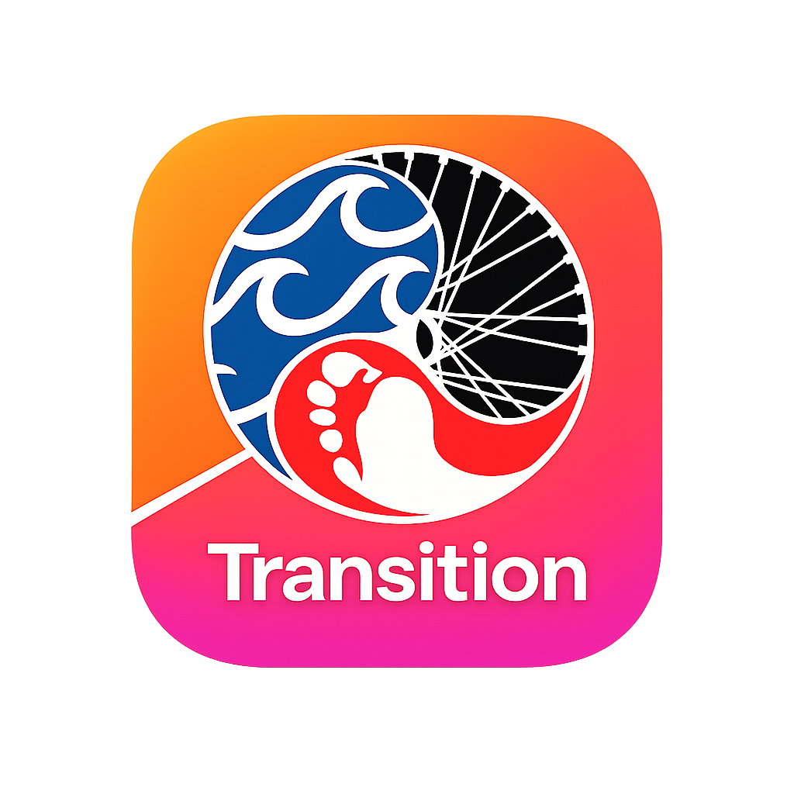

<p align="center">
  <a href="https://transitionforstrava.com">
    
  </a>
</p>

# Transition for Strava

<p align="center"><strong>Export your Strava activities as GPX or FIT files.</strong></p>

<p align="center">
  <a href="https://nextjs.org/"></a>
  <a href="https://www.typescriptlang.org/"></a>
  <a href="LICENSE"></a>
  
  
  <br/>
  
  
  
  <a href="https://transitionforstrava.com"></a>
</p>

## What is this?

A small web app that reads your Strava activities and hands you a GPX or FIT file. Use it to back up a ride, move it to Garmin or Zepp, or keep a local archive.

With Transition for Strava you can:

1. Sign in with Strava and browse recent activities, with elevation profiles
2. Export an activity as **GPX** or **FIT**, then share it (phone) or download it (desktop)
3. Open **Segments** for starred segments, recent efforts, and how much you improved
4. Use it in the browser: [transitionforstrava.com](https://transitionforstrava.com)

**You do not need an account here** — sign-in is Strava OAuth only.  
**You do not need Strava Summit** to export activities. Summit is only for segment effort history.

Strava is a trademark of Strava, Inc. This project is independent.

> Beta — it works, but things may still change.

---

## Quick start

Best way to use it: open [transitionforstrava.com](https://transitionforstrava.com).

1. Tap **Continue with Strava**
2. Browse activities (last **7** or **30** days) or open **Segments**
3. Tap **Export** and choose **GPX** or **FIT**
4. On a phone, share the file. On a desktop, it downloads.

How you know it worked: the file opens in another app, or it lands in Downloads.

---

## Using it

| | What it does |
| --- | --- |
| **Activities** | Last 7 or 30 days. Filter by sport and name. Each card shows an elevation profile |
| **Export** | GPX or FIT. Share sheet on a phone when the browser supports it; file download on a desktop |
| **Segments** | Starred segments, up to 10 efforts from the last 12 months, time improved, compare any two efforts, link to the Strava leaderboard |
| **Log out** | Clears the session cookie and returns you home |

### Export formats

| | What you get |
| --- | --- |
| **GPX** | Built from Strava GPS streams. Opens in most mapping and training apps |
| **FIT** | Generated from your Strava data (not a re-upload of the original device file). Sport type, timing, elevation, heart rate, and related fields when Strava has them |

Sport type is detected for you (cycling, running, e-bike, and more). Metrics such as elevation, speed, heart rate, cadence, and power are included when the activity has them.

### Phone vs desktop

| | Phone | Desktop |
| --- | --- | --- |
| Sign-in | Same Strava OAuth flow | Same Strava OAuth flow |
| Export | Share sheet when the browser supports it | File download |
| Notes | iOS may need you to open the file from Downloads or Files before sharing | Chrome, Firefox, Safari, or Edge |

---

## Security & privacy

- **No password storage** — sign-in goes through Strava OAuth only.
- **Signed OAuth `state`** — login CSRF protection is a short-lived signed token in the OAuth URL.
- **Encrypted session cookie** — Strava access and refresh tokens live only in an httpOnly `pp_session` cookie (not `localStorage`).
- **No activity file storage** — GPX and FIT files are generated on demand and discarded after the response.
- **No database** — nothing is kept on the server beyond the session cookie on your device.

See [SECURITY.md](./SECURITY.md) for cookie and CSRF details.

---

## Notes

- **Segments** need a **Strava Summit** subscription for effort history.
- Indoor, manual, or privacy-restricted activities may have no GPS track and cannot be exported.
- FIT files are **generated** from Strava streams, not the original device upload.
- Download and share behaviour varies by browser and OS.

---

## Mini glossary

| Word | Meaning |
| --- | --- |
| **GPX** | GPS exchange file most mapping apps can open |
| **FIT** | Activity file (Garmin-style) generated here from Strava streams |
| **Session cookie** | Encrypted httpOnly cookie (`pp_session`) that holds your Strava tokens |
| **Signed state** | Short-lived token in the OAuth URL that blocks a forged login |
| **Summit** | Strava subscription required for segment effort history |

---

## Helpful links

- Live site: [transitionforstrava.com](https://transitionforstrava.com)
- Security notes: [SECURITY.md](./SECURITY.md)
- Local setup checklist: [SETUP_CHECKLIST.md](./SETUP_CHECKLIST.md)
- Report a problem: [GitHub issues](https://github.com/thaum-labs/transition-for-strava/issues) — include device, browser, what you tapped, and the exact error
- Licence: [MIT](LICENSE)

---

## For developers

<details>
<summary>Click to expand</summary>

Requirements: Node.js 20.x

```bash
git clone https://github.com/thaum-labs/transition-for-strava.git
cd transition-for-strava
cp .env.example .env.local
# Fill in SESSION_SECRET, STRAVA_CLIENT_ID, STRAVA_CLIENT_SECRET,
# STRAVA_REDIRECT_URI, and APP_BASE_URL
npm install
npm run generate-secret
npm run dev
```

Set the same callback in your [Strava API application](https://www.strava.com/settings/api) as `STRAVA_REDIRECT_URI`. For local use: `http://localhost:3000/api/auth/strava/callback`.

```
app/        pages and API routes (activities, segments, Strava OAuth, export)
src/        activity cards, export sheet, GPX/FIT builders, session
public/     logo
scripts/    production start, session secret, OAuth state tests
```

```bash
npm run dev          # local Next.js server
npm run build        # production build
npm start            # production server
npm test             # OAuth state tests
npm run lint         # ESLint
npm run generate-secret
```

</details>

---

Created by **Thaum Labs**

**Transition for Strava** — export your Strava activities as GPX or FIT files
